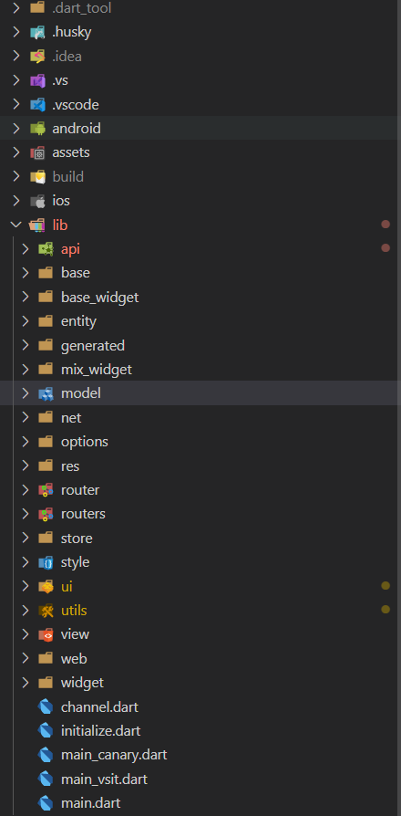

# LKL-Flutter-Helper 介绍

## 前言

由于我们都是从前端兼容过来写flutter APP的，所以在编码过程中都多少会受到之前开发模式的影响，比如api层的组织，路由模块的管理和页面文件的布局等，但是由于社区原因，目前提供给flutter/dart的社区工具确实不多，所以针对开发期间遇到的种种问题，我写了一个脚手架命令行工具，专门解决一些问题，下面先列举一些常见的app开发中的问题

+ 新建页面时，通常需要新建 `view.dart` 和 `logic.dart`，而我们最喜欢的就是将某个之前写好的模块进行`ctrl c + v`......

+ 新建api请求模型时，需要新建 `model.dart`, `api.dart`，以及向全局api文件添加请求路径，依然是一个复制粘贴过程

+ 打包的时候，早期我们会在cmd中敲入 `flutter build apk lib\main_vsit.dart` 命令，这个太长了很难记的...

+ 等等.......

针对这些问题，这个命令行工具诞生了 lkl-flutter-helper

> 该脚手架是为内部项目定制化的，不一定适合所有flutter项目，因为这是针对公司内现有项目代码组织结构而规划的，若其他朋友在使用过程中有问题可提[issues](https://github.com/chensidi/lkl-flutter-helper/issues)，到时候我们整理一下，发布一个更通用的脚手架



## 安装

```shell
  npm i lkl-flutter-helper -g
```

之后可以通过 `lkl-flu -h` 查看相关命令帮助

## 功能介绍

### 新增api

|  属性   | 描述  |
|  ----  | ----  |
| 命令名称  | addApi |
| 能力  | 1. 添加对应model层 <br/> 2. 添加对应api请求函数文件 <br/> 3. 在api接口管理文件上追加请求的url  |

### 新增页面

|  属性   | 描述  |
|  ----  | ----  |
| 命令名称  | addPage |
| 能力  | 1. 添加对应视图文件 <br/> 2. 添加对应logic数据文件 <br/> 3. page和logic是绑定的 <br> 4. 支持递归选择子目录  |

### 添加scripts字段

|  属性   | 描述  |
|  ----  | ----  |
| 命令名称  | addScripts |
| 能力  | 添加一套flutter 常用命令模板script至package.json中|

### 打包相关命令

|  属性   | 描述  |
|  ----  | ----  |
| 命令名称  | build，在打包结束后会在资源管理器自动打开apk所在目录 |
| 参数  | -V, --vsit, 打vsit环境的安装包 |
| 参数  | -C, --canary, 打canary环境的安装包 |
| 参数  | -P, --production, 打production环境的安装包 |
| 打包记录  | 每次构建会在项目根目录生成日志json,记录构建时间，提交记录，构建时长及产物大小等等 <br> 每次构建完成会将本次apk副本保存 |
